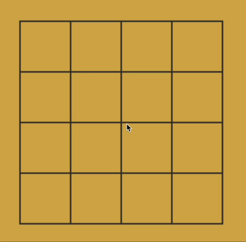

# **MiniGo_Agent**

**MiniGo_Agent** is a Go player designed specifically for the compact **5x5 board**. This project features two advanced Go agents and a parameter optimization framework powered by [Optuna](https://optuna.org/). The optimization framework fine-tunes the agent’s performance against a wide range of opponents.

The two agents are built on:
- **Alpha-Beta Pruning**: A search-based algorithm for strategic decision-making.
- **DQN (Deep Q-Learning)**: A reinforcement learning-based agent for adaptive play.

Both agents have shown exceptional performance, defeating 142 human players and competing effectively against online Go agents like [Cosumi](https://www.cosumi.net/en/).

---

## **Code Restrictions**
Due to the rules of **Course 561**, the code cannot be shared publicly. However, the following is a record of the **DQN agent** competing against an online agent:

---

## **Features**
- **Compact 5x5 Board**: Designed for a smaller-scale Go environment with unique strategic challenges.
- **Multi-Agent Competition**: Includes two distinct agents (Alpha-Beta Pruning and DQN) with competitive results.
- **Parameter Optimization**: Utilizes [Optuna](https://optuna.org/) to fine-tune agent parameters for optimal performance.

---

## **Performance Highlights**
- **Human Competition**: Defeated 142 human players.
- **Online Go Platforms**: Competed successfully against agents on platforms like [Cosumi](https://www.cosumi.net/en/).

---

## **Future Work**
- Expanding the scope to larger board sizes (e.g., 9x9) while maintaining optimization efficiency.
- Enhancing the DQN framework for better adaptability against diverse play styles.
- Investigating hybrid techniques that combine Alpha-Beta Pruning and reinforcement learning for even stronger agents.